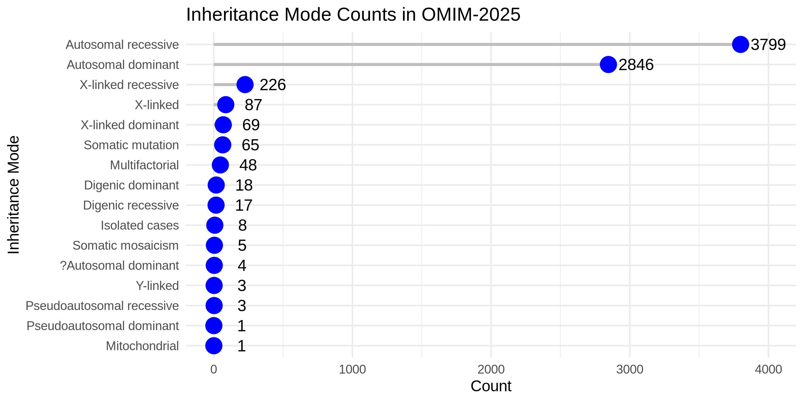

# OMIM inheritance parser and summary statistics

This script extracts inheritance mode data from OMIM’s genemap2 file and generates structured outputs for analysis.  

## **1. Features**
✅ Parses OMIM genemap2.txt  
✅ Extracts inheritance mode statistics  
✅ Outputs clean TSV files for downstream analysis  

- [omim_extract_inheritance.py](omim_extract_inheritance.py) - parse OMIM's genemap2.txt file
- [omim_plot_inheritance_dictionary.R](omim_plot_inheritance_dictionary.R) - plot summary statistics



## **2. Installation**

Clone the repository:
```bash
git clone https://github.com/naumenko-sa/bioscripts.git
cd bioscripts/omim
```

## **3. Usage Examples**

To extract inheritance data from OMIM genemap2. 
Obtain genemap2.txt on the [OMIM website](https://omim.org/downloads)
and save in the current dir

Short call (genemap2.txt and the script in the same dir)
```bash
python omim_parser.py
```

Full call
```bash
python omim_parser.py \
--omim_genemap2 genemap2.txt \
--omim_inheritance omim_inheritance.tsv \
--omim_inheritance_dictionary omim_inheritance_dictionary.tsv
```

## **4. Example Output**

The script generates an inheritance table (`omim_inheritance.tsv`) with the following format:

```tsv
ensembl_gene_id	gene_name	omim_inheritance
ENSG00000187608	ISG15	Autosomal recessive
ENSG00000107404	DVL1	Autosomal dominant
ENSG00000197785	ATAD3A	Autosomal dominant;Autosomal recessive
```

The other output file is inheritance mode dictionary (`omim_inheritance_dictionary.tsv`) with the following format:

```tsv
inheritance_mode	count
Autosomal recessive	3799
Autosomal dominant	2846
X-linked recessive	226
```

## **5. Plotting the summary stats**

Outputs `omim_inheritance2025.png`:

```bash
Rscript omim_plot_inheritance_dictionary.R
```

Or run the script in R-studio.

